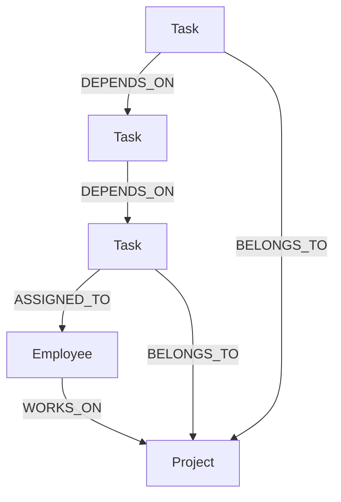

# TaskGraph — Team and Project Dependency Tracker

This is a small app I built for the Wexa AI CognoDB take-home assignment. It's a graph-database-backed tool for tracking how tasks, employees, and projects depend on each other.

Live demo: `https://wexa-six.vercel.app/`
Backend API: `https://wexa-l34t.onrender.com/api`
Screen recording: `<add your recording link here>`

One thing to note: the backend is hosted on Render's free tier, so it spins down when it's idle. If you're trying the demo and it feels slow the first time, that's just the server waking up. It usually takes under a minute.

## What problem this solves

On most teams, tasks don't exist on their own. They block each other, share the same owners, and belong to projects that depend on other projects. When something slips, the real impact usually isn't obvious from a flat list or a spreadsheet. You end up asking questions like: if this task is late, what else gets held up because of it? If this person goes on leave, which tasks and projects are actually at risk? And if I add a new dependency between two tasks, am I accidentally creating a loop?

TaskGraph is built to answer exactly those questions.

## Why I used a graph database for this

Task dependencies are naturally a graph. Any task can depend on any number of other tasks, and those chains can go several levels deep. In a relational database, figuring out everything that's indirectly affected by one task usually means writing a recursive query or repeatedly joining a table against itself, and that gets messier and slower the deeper the chain goes. In Cypher, the same question is one short, readable query that walks the relationship as many hops as needed.

The same idea applies to preventing circular dependencies. Before I let someone add a new dependency, the app checks whether a path already exists going the opposite way. If it does, adding the new one would create a loop, so it gets rejected. That check is a single graph traversal here, but it would be a genuinely awkward thing to write in SQL.

## How the data is modeled

There are three types of nodes: Employee, Project, and Task.

An Employee has an id, a name, a role, and an email. A Project has an id, a name, a status, and a deadline. A Task has an id, a title, a status, a priority, and an estimate in days.

There are four relationships connecting them. An employee works on a project. A task belongs to a project. A task is assigned to an employee. And a task can depend on another task, meaning it can't move forward until that other task is done.

Here's a simple diagram of how these connect:



## The main queries worth looking at

The most important one is the dependency chain query. Given a task, it finds every task upstream that it depends on, and every task downstream that depends on it, walking as many hops as needed:

```
MATCH (t:Task {id: $taskId})-[:DEPENDS_ON*1..10]->(dep:Task)
RETURN DISTINCT dep
```

There's a similar one for employees. For every task a person owns, it finds everything that would be affected if that task slipped, which is basically answering "what's at risk if this person is unavailable":

```
MATCH (e:Employee {id: $employeeId})<-[:ASSIGNED_TO]-(t:Task)
OPTIONAL MATCH (blocked:Task)-[:DEPENDS_ON*1..10]->(t)
RETURN t, collect(DISTINCT blocked) AS blockedTasks
```

And the cycle check I mentioned earlier runs before any new dependency gets created:

```
MATCH (b:Task {id: $dependsOnId})-[:DEPENDS_ON*1..20]->(a:Task {id: $taskId})
RETURN count(*) > 0 AS wouldCreateCycle
```

Every query in the project is parameterized through the official Neo4j driver. There's no string concatenation anywhere in the Cypher.

## What the stack looks like

The backend is Node.js with Express, using the official neo4j-driver package to talk to CognoDB over Bolt. The frontend is React with Vite, styled with Tailwind and shadcn components. CognoDB itself is the graph database, speaking openCypher.

## How the project is organized

The backend follows a fairly standard layered structure. Routes just map URLs to controllers. Controllers handle the request and response and are wrapped in an asyncHandler so errors get forwarded automatically. Services hold all the actual Cypher queries and business logic. Errors are thrown as named classes like NotFoundError or BadRequestError, and a single error handler in the Express app turns those into the right HTTP response.

The frontend has an api folder with functions for calling the backend, and a components folder with the main pieces: the sidebar for picking who you are and which project you're viewing, the task list, the dependency panel that shows the upstream and downstream chain for a selected task, and the dialogs for adding a task or a new dependency.

## Running it on your own machine

First you'll need a CognoDB instance. Go to console.cognodb.com, sign up, and create a free instance. It only takes a minute to provision and doesn't need a credit card. Once it's ready, you'll get a connection URI and a password for the user cognodb. The password is only shown once, so save it somewhere.

For the backend, go into the backend folder, run npm install, copy .env.example to .env and fill in your CognoDB URI, username, and password, then run npm run seed to load some sample data, and npm run dev to start the server.

For the frontend, go into the frontend folder, run npm install, create a .env file with VITE_API_URL pointing to your backend (http://localhost:4000/api if you're running it locally), and run npm run dev.

## A note on error handling

If CognoDB becomes unreachable for any reason, the backend doesn't crash or return a raw error. It catches that specific failure and returns a clean message with a 503 status, so the frontend can show something sensible instead of breaking.

## Screenshots


